<h1 align="center">ELO - Hub de Inteligência Urbana</h1>

  <strong>A plataforma definitiva que conecta Cidadania, Gestão Pública e Economia Circular.</strong> 
  <em>Projeto destaque idealizado para o ecossistema de Smart Cities (Cidades Inteligentes), com piloto projetado para a região de Barra Bonita (Caminhos do Tietê) e validação no programa Empreenda Senac.</em>

  <b>Status do Projeto:</b> Em contínuo desenvolvimento. (Plataforma Web/MVP concluída (faltam apenas pequenas atualizações) | App Mobile em fase de planejamento). 🚧

---

## Visão Geral

O **ELO Hub** é um sistema integrado (SaaS) B2G e B2B que revoluciona a zeladoria urbana e a causa animal. A plataforma elimina a fragmentação da gestão pública, permitindo que a prefeitura, o comércio local e o cidadão atuem juntos em um ecossistema sustentável movido a dados e recompensas.

**Evolução da Plataforma:** O projeto é vivo e encontra-se em constante atualização. Atualmente, o núcleo funcional da **Plataforma Web de Gestão (Dashboard e Web App)** já foi estruturado. O **Aplicativo Mobile Nativo**, focado exclusivamente na experiência do cidadão e integração avançada de geolocalização, é o próximo grande marco no nosso roadmap de desenvolvimento.

---

## O Ecossistema e Funcionalidades

### 1. Para o Cidadão (App e Web)
* **Zeladoria Inteligente em 3 Cliques:** Registro rápido de ocorrências (buracos, descarte irregular de resíduos, falhas de iluminação).
* **Voz Animal:** Canal ágil para solicitar resgates ou denunciar maus-tratos, conectando diretamente com ONGs parceiras.
* **ELO Cashback (Gamificação):** Cada problema validado e resolvido gera créditos financeiros na carteira digital do cidadão.

### 2. Para a Prefeitura (Painel B2G)
* **Central de Monitoramento Real-Time:** Mapa de calor com todas as ocorrências do município, permitindo despachos rápidos para as secretarias responsáveis.
* **Gestão de Órgãos e Relatórios:** Emissão de relatórios em PDF para acompanhamento de métricas e elevação da nota no *Programa Município VerdeAzul*.

### 3. Para o Comércio Local (Painel B2B)
* **Clube de Recompensas:** O saldo de cashback do cidadão **só pode ser gasto no comércio local parceiro**, fomentando a economia circular e fidelizando clientes através do selo sustentável ELO.

---

## Vitrine de Telas (Screenshots)

Abaixo estão as principais interfaces da plataforma, projetadas com foco absoluto em UI/UX, utilizando um design system profissional, responsivo e limpo.

### Home e Institucional

  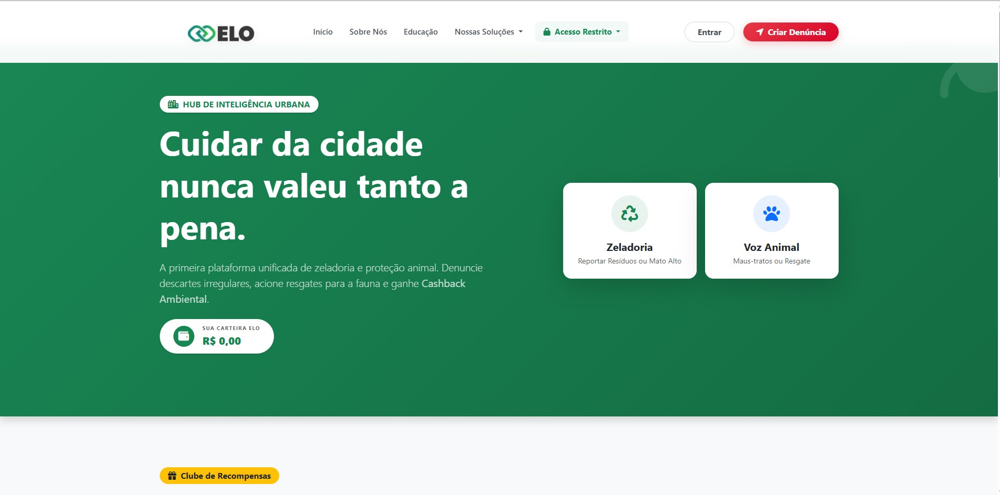
  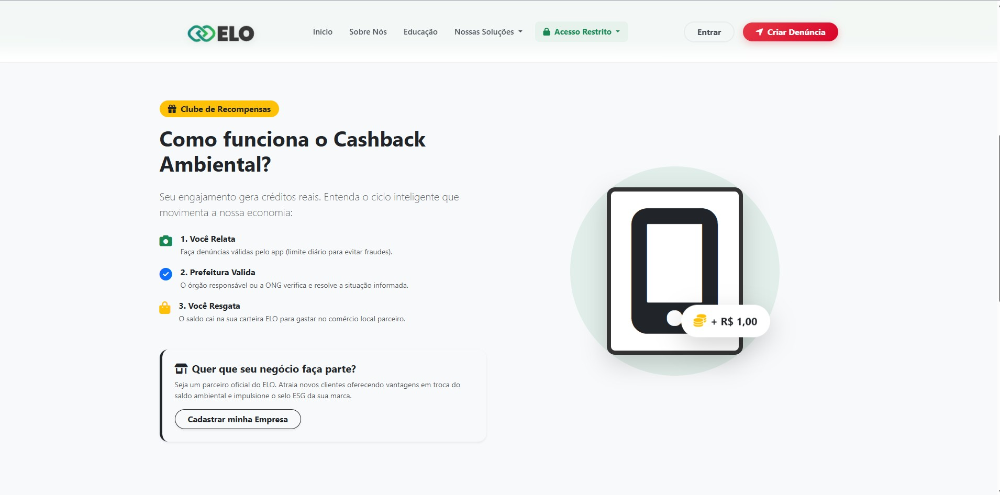
  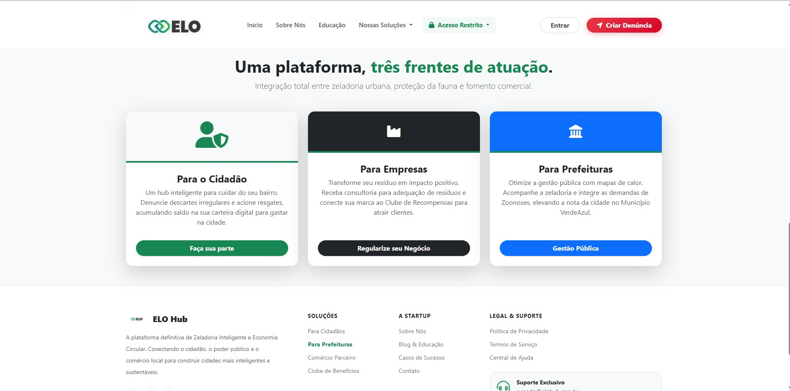

  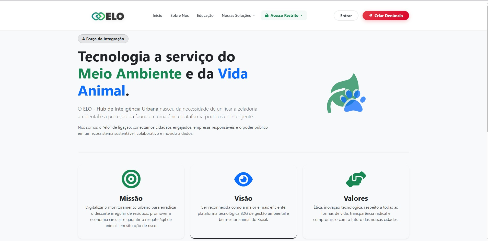
  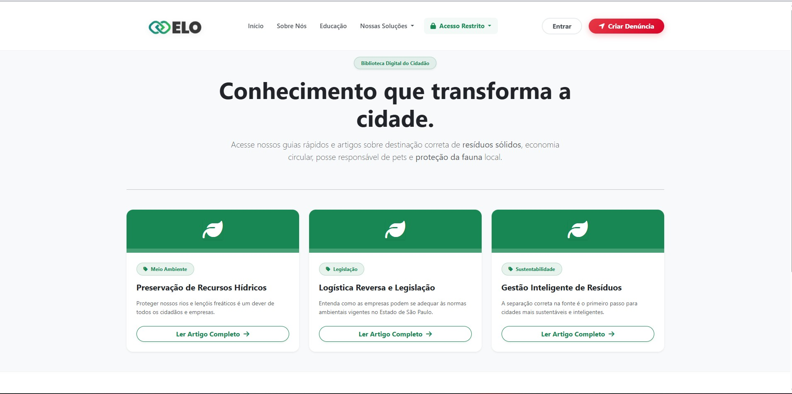

### Soluções Corporativas e Governamentais

  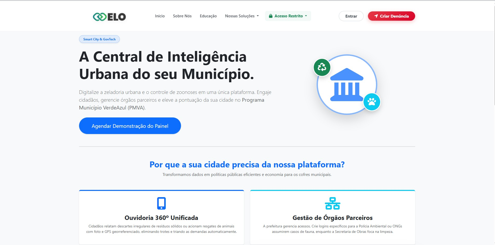
  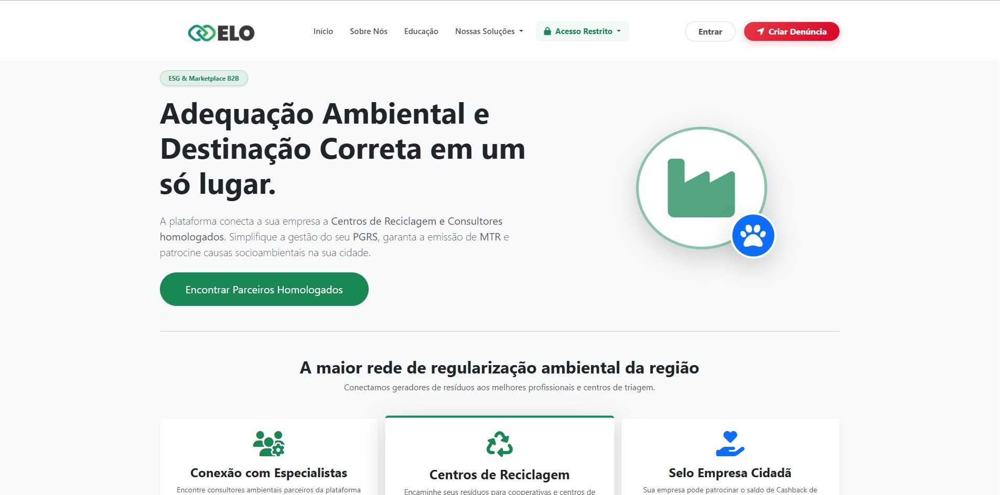

### Fluxo do Cidadão (Ouvidoria)

  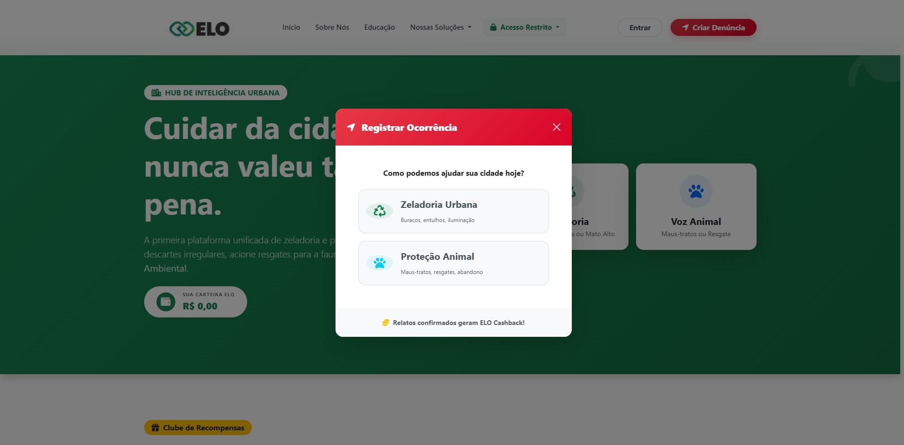
  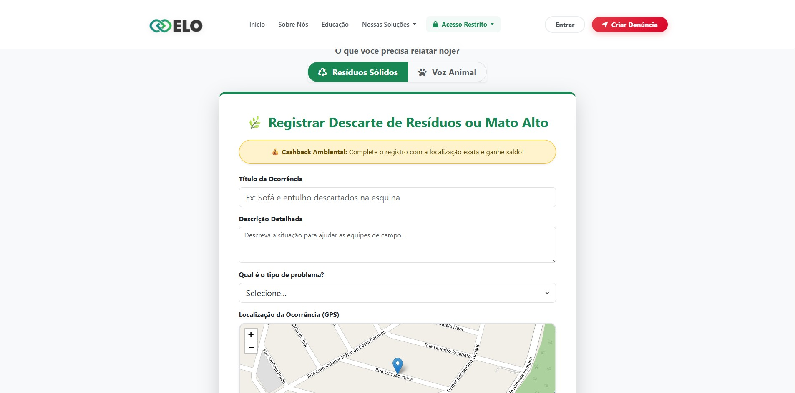

### Gestão Interna B2G (Painel Administrativo)

  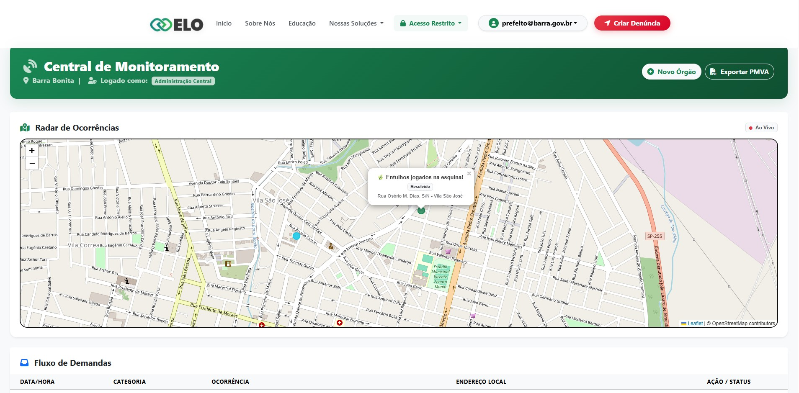
  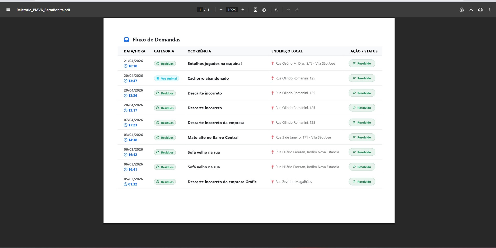
  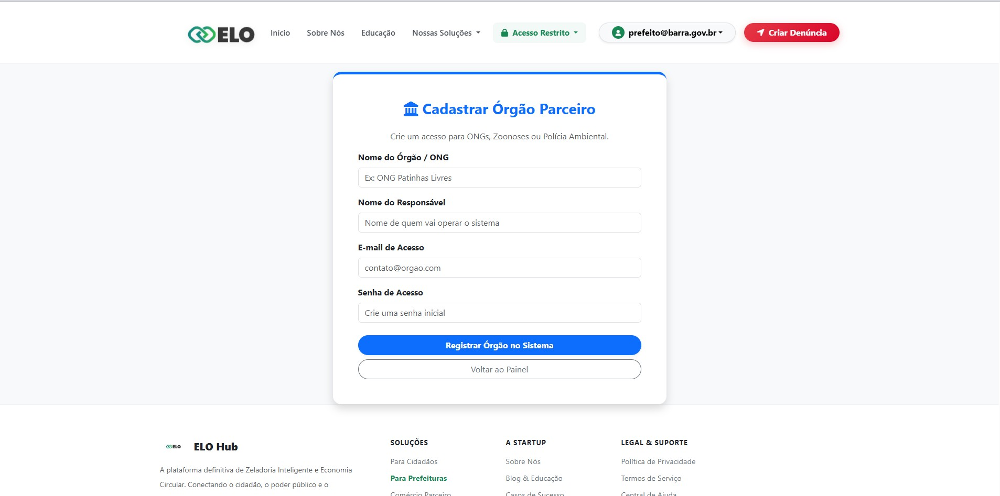

---

## Arquitetura e Stack Tecnológico

O sistema foi concebido utilizando uma arquitetura robusta e escalável:

* **Back-end:** C# com ASP.NET Core MVC
* **Front-end:** HTML5, CSS3, JavaScript, Bootstrap 5 (Customizado), FontAwesome
* **Banco de Dados:** Microsoft SQL Server integrado via Entity Framework Core (Code-First)
* **Segurança:** Autenticação via Cookies (Claims Identity), proteção CSRF
* **Integrações Nativas:** Motor de Geolocalização (GPS) no browser/app e manipulação assíncrona de mídias (Upload de imagens de evidência).
* **Infraestrutura:** Preparado para deploy em servidores de alta performance (Linux/aaPanel ou Azure).

---

## Nota sobre este Repositório (Demonstração Pública)

Este repositório serve como um **Portfólio de Arquitetura e UI/UX**. Para proteger a propriedade intelectual, as lógicas de negócio, strings de conexão e a infraestrutura real de banco de dados foram removidas ou ofuscadas (Mock).

* **O que foi retirado:** Consultas EF Core, algoritmos de cálculo de distribuição de Cashback, chaves de API, arquivos `appsettings.json` reais e Migrations.
* **O que está disponível:** Todo o Design System, organização estrutural do padrão MVC, Views, Assets (`wwwroot`), e a demonstração da estrutura de Controladores com dados simulados.

O objetivo é demonstrar a capacidade de construir interfaces premium e sistemas complexos voltados para impacto social e financeiro.
